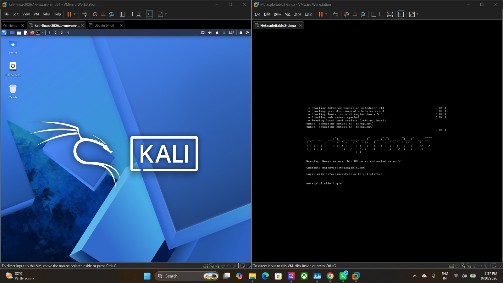
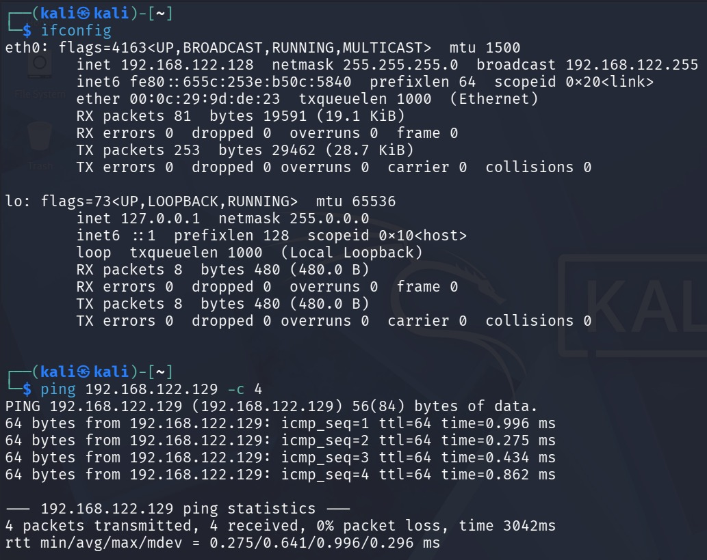
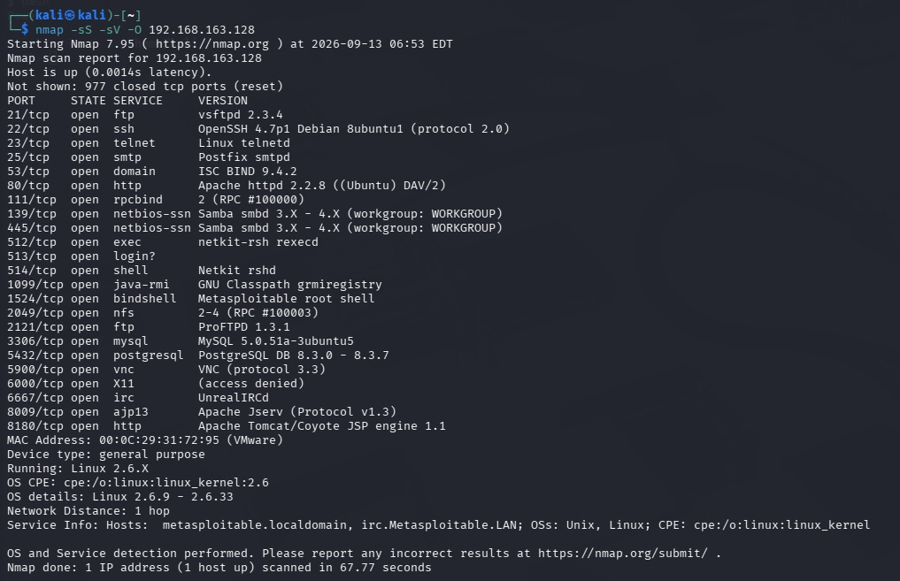
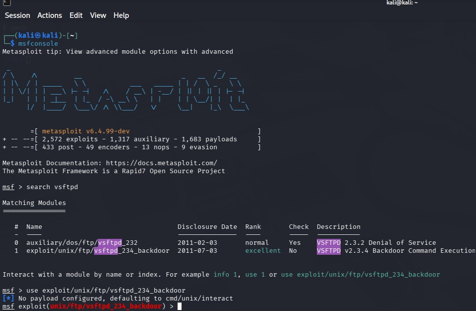
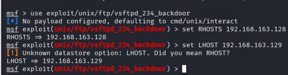
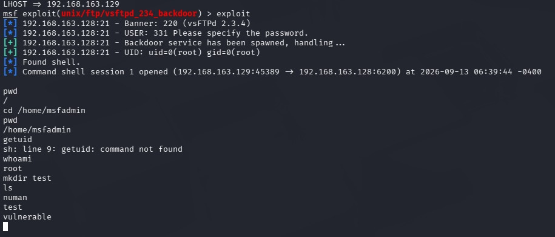

# Experiment 2: Simulated Ethical Hacking with Metasploit

## Objectiv

To perform a safe exploitation on a virtual machine using Metasploit and understand ethical hacking procedures in a controlled laboratory environment.

## Procedure

### Step 1: Configure the Virtual Machines

Set up Kali Linux as the attacker machine and Metasploitable 2 as the target machine in VMware. Configure the virtual machines to communicate through an isolated network and boot both machines.

### Step 2: Verify Network Connectivity

Check the network configuration of the Kali Linux machine and verify connectivity with the Metasploitable 2 target using its IP address.

### Step 3: Perform Information Gathering and Reconnaissance

Perform an Nmap scan of the Metasploitable 2 machine to identify open ports, running services, service versions, and operating system information. The scan results are used to identify potential vulnerable services on the target.

### Step 4: Launch Metasploit and Search for an Exploit

Launch the Metasploit Framework on Kali Linux and search for an appropriate exploit targeting the vulnerable FTP service identified during reconnaissance.

### Step 5: Select and Configure the Exploit Module

Select the appropriate Metasploit exploit module for the vulnerable FTP service and configure the target information required by the module.

### Step 6: Execute the Exploit and Verify Access

Execute the selected exploit against the Metasploitable 2 target. After successful exploitation, verify the obtained command shell and perform basic post-exploitation activities on the target machine.

##Result
The experiment was successfully performed in a controlled laboratory environment using Kali Linux, Metasploitable 2, Nmap, and the Metasploit Framework. Nmap was used for information gathering and reconnaissance, while Metasploit was used to identify and execute an appropriate exploit against the vulnerable FTP service. Successful exploitation provided access to a command shell on the target machine, allowing basic post-exploitation activities to be performed.
