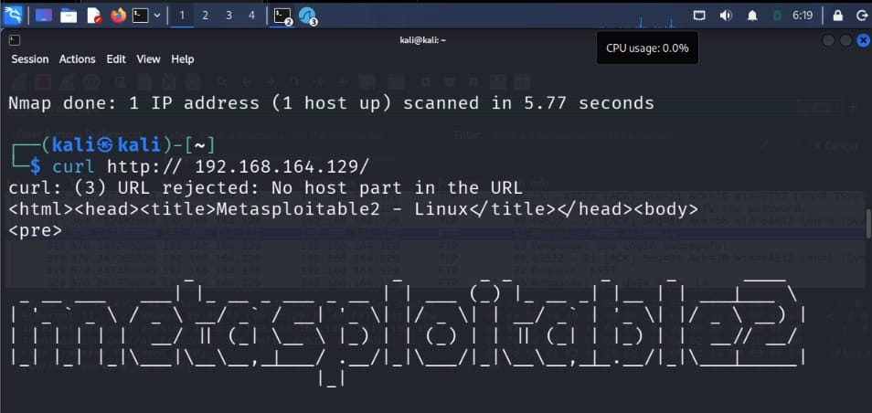
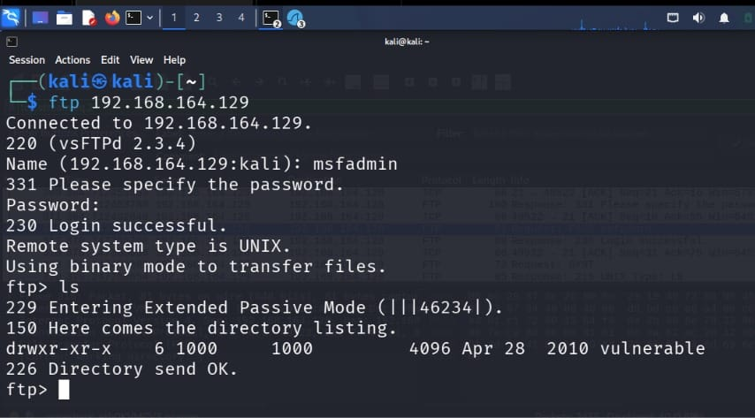

# Experiment 3: Basic Network Traffic Analysis with Wireshark

## Objective

To capture and examine network packets using Wireshark to detect suspicious activity or cleartext credentials in a simulated network.

## Procedure

### Step 1: Configure the Kali Linux and Metasploitable Machines

Open the Kali Linux and Metasploitable virtual machines and configure both to use a **Host-only Adapter**. Use `ifconfig` to identify their IP addresses and ping the Metasploitable IP from Kali to verify connectivity.

### Commands

```bash
ifconfig
ping <Metasploitable-IP>
```

### Screenshot


---

### Step 2: Identify the Network Interface and Scan the Target

Use `ip a` on Kali Linux to identify the active network interface, such as `eth0`. Then perform an Nmap scan against the Metasploitable IP to identify open ports and services.

### Commands

```bash
ip a
nmap -sS -Pn <Metasploitable-IP>
```

### Screenshot


---

### Step 3: Start Wireshark and Configure Packet Capture

Launch Wireshark and select the `eth0` interface. Apply a capture filter for the Metasploitable IP address and start capturing network traffic.

### Capture Filter

```text
host <Metasploitable-IP>
```

### Screenshot


---

### Step 4: Generate HTTP and FTP Traffic

While Wireshark is capturing packets, generate traffic from a Kali terminal by accessing the Metasploitable web service and connecting to its FTP service.

Log in to the FTP service using the available lab credentials.

### Commands

```bash
curl http://<Metasploitable-IP>
ftp <Metasploitable-IP>
```

### Screenshots





---

### Step 5: Identify and Inspect FTP Packets

Return to Wireshark and locate the captured FTP packets generated during the FTP session. Select an FTP packet and use:

**Follow → TCP Stream**

to inspect the communication.

### Screenshot


---

### Step 6: Analyze the TCP Stream

Examine the followed TCP stream to observe the FTP communication, including the credentials transmitted in cleartext.

### Screenshot


